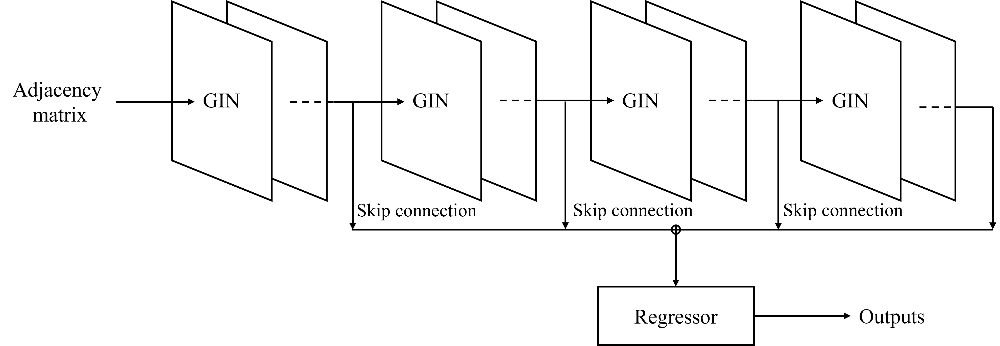

# Prediction-and-mitigation-of-nonlocal-cascading-failures-using-graph-neural-networks
Code and data for paper 'Prediction and mitigation of nonlocal cascading failures using graph neural networks'

## Requirements
- Python codes are executed using python environment in `env.yaml` is required.
- Cpp code is tested at gcc 11.1.0, c++17 standard.


## `construct_shk.py`: Constructing synthetic electric power grid network
Construct synthetic electric power grid following rules introduced at [*A random growth model for power grids and other spatially embedded infrastructure networks*](https://link.springer.com/article/10.1140/epjst/e2014-02279-6) by P. Schultz, J. Heitzig, J. Kurths (2014).

To find out which arguments are available, run `python construct_shk.py --help` or refer to the following.
```
usage: construct_shk.py [-h] [--initial_num_nodes INITIAL_NUM_NODES] [--num_nodes NUM_NODES] [-p P] [-q Q] [-r R]
                        [-s S] [--ensemble_name ENSEMBLE_NAME] [--ensemble_idx ENSEMBLE_IDX]

optional arguments:
  -h, --help            show this help message and exit
  --initial_num_nodes INITIAL_NUM_NODES
                        Number of initial nodes
  --num_nodes NUM_NODES
                        Final number of nodes
  -p P                  Model parameter p
  -q Q                  Model parameter q
  -r R                  Model parameter r
  -s S                  Model parameter s
  --ensemble_name ENSEMBLE_NAME
                        Name of ensemble of networks
  --ensemble_idx ENSEMBLE_IDX
                        Ensemble index
```

## `simulation/motter_lai.cpp`: Simulating motter-lai model
Run motter-lai model introduced at [*Cascade-based attacks on complex networks*](https://journals.aps.org/pre/abstract/10.1103/PhysRevE.66.065102) by A.E. Motter, Y.C. Lai (2002). $a=0.25$ is used.
```
$ g++ motter_lai.cpp
$ ./a.out <network name> <alpha>
```

## `data`: Results of motter-lai model
Results of motter-lai model simulation, summarized in `pandas.dataframe` of python.
- Synthetic electric power grids: From `construct_shk.py`
  - `shk_rand_0.25.pkl`: train/validation dataset. SHK network of network size selected at random from $N=100-999$. $10^3$ data are uploaded due to size limit of GitHub(100MB). Larger dataset consisting of $10^4$ data (`shk_rand_10x_0.25.pkl`) is provided upon request.
  - `shk_N_0.25.pkl`: test dataset. Results of $100$ SHK networks of network size $N$.
- Real electric power grids: From [*Dynamically induced cascading failures in power grids*](https://www.nature.com/articles/s41467-018-04287-5) by B. Schäfer, D. Witthaut, M. Timme, V. Latora (2018)
  - `es_98_0.25.pkl`: test dataset. Result of Spain power grid network.
  - `fr_146_0.25.pkl`: test dataset. Result of France power grid network.
  - `gb_120_0.25.pkl`: test dataset. Result of Great Britain power grid network.

## `gnn/main.py`: Train GNN and test
Train and test GNN with the structure of following figure.
|  |
|:--|
| Batch normalization and ReLU activation are applied between each adjacent GIN layers, but they are omitted from the diagram for simplicity. |

To find out which arguments are available, run `python main.py --help` or refer to the following
```
usage: main.py [-h] [--data_dir DATA_DIR] [--train TRAIN [TRAIN ...]] [--val VAL [VAL ...]]
               [--add_degree {normalize,log,inverse,sqrt} [{normalize,log,inverse,sqrt} ...]]
               [--add_network_size {inverse,sqrt,log} [{inverse,sqrt,log} ...]]
               [--label {avalanche_fraction,failure_fraction,avalanche_centrality}]
               [--scaler {None,QuantileScaler}] [--model {SkipGINNet}] [--num_layer NUM_LAYER]
               [--hidden_feature HIDDEN_FEATURE] [--num_parallel NUM_PARALLEL] [--hop_length HOP_LENGTH]
               [--num_out NUM_OUT] [--out_act {sigmoid,hardsigmoid,softsign,modified_sigmoid}] [--dropout DROPOUT]
               [--bn_momentum BN_MOMENTUM] [--networkwise] [--loss {MSE,MAE,R2}] [--objective OBJECTIVE]
               [--optimizer {Adagrad,Adam,RMSprop,SGD}] [--learning_rate LEARNING_RATE]
               [--weight_decay WEIGHT_DECAY] [--clip CLIP] [--schedular {Cosine}]
               [--schedular_period SCHEDULAR_PERIOD] [--schedular_period_mult SCHEDULAR_PERIOD_MULT]
               [--warmup WARMUP] [--schedular_eta_max SCHEDULAR_ETA_MAX]
               [--schedular_eta_max_mult SCHEDULAR_ETA_MAX_MULT] [--patience PATIENCE]
               [--early_stop_delta EARLY_STOP_DELTA] [--device {cpu,cuda:0,cuda:1,cuda:2,cuda:3,0,1,2,3}]
               [--seed SEED] [--epochs EPOCHS] [--batch_size BATCH_SIZE]
               [--log_level {debug,info,warning,error,critical}] [--no_tqdm] [--root_dir ROOT_DIR]
               [--exp_id EXP_ID]

optional arguments:
  -h, --help            show this help message and exit
  --data_dir DATA_DIR   data path
  --train TRAIN [TRAIN ...]
                        Network type for train dataset
  --val VAL [VAL ...]   Network type for validation dataset
  --add_degree {normalize,log,inverse,sqrt} [{normalize,log,inverse,sqrt} ...]
                        normalize: [degree/max_degree] log: [log10(degree)] inverse: [1/degree] sqrt:
                        [1/sqrt(degree)] as additional input feature
  --add_network_size {inverse,sqrt,log} [{inverse,sqrt,log} ...]
                        inverse: [1/N] sqrt: [1/sqrt(N)] log: [1/log10(N)] as additional input feature
  --label {avalanche_fraction,failure_fraction,avalanche_centrality}
                        Which quantity to predict
  --scaler {None,QuantileScaler}
                        Which scaler to use scaling label
  --model {SkipGINNet}  GNN model name
  --num_layer NUM_LAYER
                        Number of GNN layer
  --hidden_feature HIDDEN_FEATURE
                        Dimension for hidden feature
  --num_parallel NUM_PARALLEL
                        Number of mlp layers used in GIN
  --hop_length HOP_LENGTH
                        How many neighbors to count at once
  --num_out NUM_OUT     Number of layers at regressor
  --out_act {sigmoid,hardsigmoid,softsign,modified_sigmoid}
                        Activation function for out layer
  --dropout DROPOUT     dropout rate
  --bn_momentum BN_MOMENTUM
                        Momentum of batch norm
  --networkwise         If this flag is on, metrics are calculated networkwise and then averaged
  --loss {MSE,MAE,R2}   Metric name to use as loss: back-propagation
  --objective OBJECTIVE
                        Metric name for early stopping. Include inv_ in front of metric name if you want to
                        measure after inverse scaling.
  --optimizer {Adagrad,Adam,RMSprop,SGD}
                        torch optimizer names
  --learning_rate LEARNING_RATE
                        learning rate
  --weight_decay WEIGHT_DECAY
                        Weight decay for optimizer
  --clip CLIP           Maximum norm of gradients
  --schedular {Cosine}  Which schedular to control learning rate
  --schedular_period SCHEDULAR_PERIOD
                        Period of cosine annealing shedular. When set to 0, schedular will not be used
  --schedular_period_mult SCHEDULAR_PERIOD_MULT
                        Multiplier of period of schedular.
  --warmup WARMUP       Number of epochs for warm up stage
  --schedular_eta_max SCHEDULAR_ETA_MAX
                        Base eta max used in consine annealing schedular. See detailed description at class
                        CosineAnnealingWarmRestart
  --schedular_eta_max_mult SCHEDULAR_ETA_MAX_MULT
                        Multiplier of base eta max. See detailed description at class CosineAnnealingWarmRestart
  --patience PATIENCE   How many epochs to wait after validation loss is improved
  --early_stop_delta EARLY_STOP_DELTA
                        Minimum change of validation loss to regard as improved
  --device {cpu,cuda:0,cuda:1,cuda:2,cuda:3,0,1,2,3}
                        device to use
  --seed SEED           Seed for torch random
  --epochs EPOCHS       Maximum number of epochs
  --batch_size BATCH_SIZE
                        batch size
  --log_level {debug,info,warning,error,critical}
                        Level of logging
  --no_tqdm             When this flag is on, do not use tqdm
  --root_dir ROOT_DIR   Root directory for experiments.
  --exp_id EXP_ID       Experiment index. When specified, load the experiemt
```


## `gnn/experiment`: Trained models
The trained models and training logs are stored in the directory.
- Experiment 1-4: predicts ranks of avalanche centrality
- Experiment 5-8: predicts values of avalanche centrality

## `simulation/strategy_motter_lai.cpp`: Mitigation of cascading failure
Check the effectiveness of avalanche mitigation strategy at motter-lai model.
```
$ g++ strategy_motter_lai.cpp
$ ./a.out <network name> <alpha> <strategy name> <reinforced fraction>
```